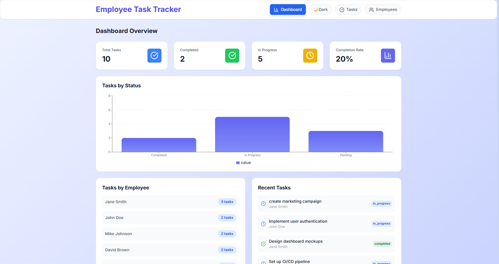
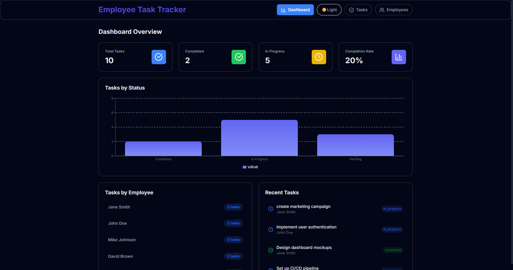
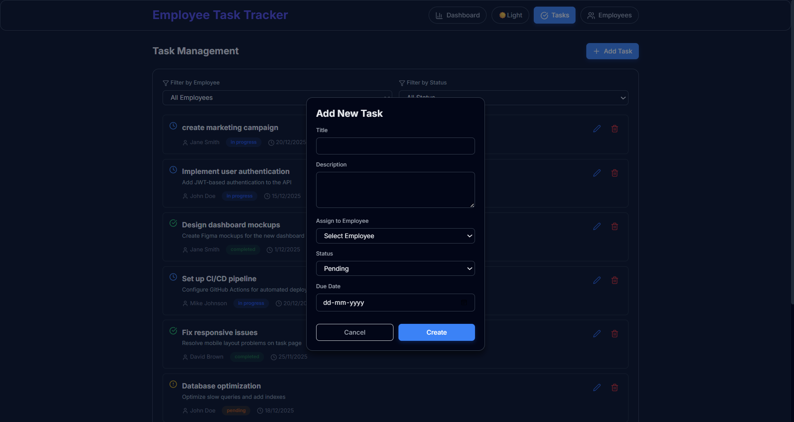
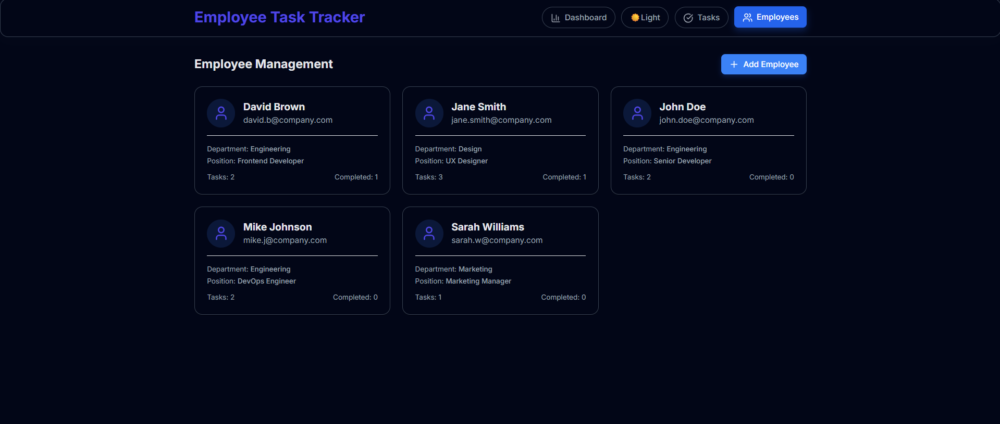

#  Employee Task Tracker

> A full-stack web application for managing employees and their tasks within an organization. Built with React, Flask, and SQLite.

[](https://reactjs.org/)
[](https://flask.palletsprojects.com/)
[](https://www.sqlite.org/)
[](LICENSE)

## Demo Video
https://drive.google.com/file/d/16iMQfNMNcSER3BAxy1KkoohUe9BrcHqX/view?usp=sharing

## 📸 Screenshots

### 🟦 Dashboard & Dark Mode

| Dashboard | Dark Mode |
|-----------|-----------|
|  |  |
| *Main dashboard with task analytics and statistics* | *Dark mode for better low-light usability* |

---

### 📝 Task Management & Create Task

| Task List | Create Task |
|-----------|------------|
|  |  |
| *Manage tasks with filters and status updates* | *Create new tasks using modal form with validation* |

---

### 👥 Employee Management

| Employee Dashboard | Employee Details |
|--------------------|------------------|
|  |  |
| *Employee cards showing task stats* | *Detailed employee task history screen* |

---

## 🌗 Theme Support

This application supports both **Light Mode** and **Dark Mode** for better accessibility and user comfort.  
Users can easily toggle between themes using the theme switch button available on the top right corner.

---


## 🎯 Features

### ✨ Core Functionality
- **Dashboard Analytics** - Real-time statistics and task completion metrics
- **Employee Management** - Add, view, and manage employee information
- **Task Management** - Full CRUD operations for tasks with status tracking
- **Advanced Filtering** - Filter tasks by employee and status
- **Responsive Design** - Works seamlessly on desktop, tablet, and mobile devices

### 🎨 UI/UX Highlights
- Modern, clean interface with gradient backgrounds
- Color-coded task statuses (Pending, In Progress, Completed)
- Visual status indicators with icons
- Smooth animations and transitions
- Loading states and error handling
- Modal dialogs for creating/editing records
- Confirmation prompts for destructive actions

### 🔧 Technical Features
- RESTful API architecture
- Database relationships with foreign keys
- Input validation and error handling
- CORS-enabled backend
- Sample data for quick testing
- Modular component structure

---

## 🏗️ Architecture Overview

```
┌─────────────────────────────────────────────────────────────┐
│                        FRONTEND                              │
│                   React Application                          │
│  ┌──────────────────────────────────────────────────────┐  │
│  │  Components:                                          │  │
│  │  • Dashboard (Statistics & Analytics)                 │  │
│  │  • TaskManagement (CRUD Operations)                   │  │
│  │  • EmployeeManagement (Employee Cards)                │  │
│  │  • Modals (Task & Employee Forms)                     │  │
│  └──────────────────────────────────────────────────────┘  │
└───────────────────────┬─────────────────────────────────────┘
                        │ HTTP/REST API
                        │ (JSON)
┌───────────────────────▼─────────────────────────────────────┐
│                        BACKEND                               │
│                   Flask REST API                             │
│  ┌──────────────────────────────────────────────────────┐  │
│  │  Routes:                                              │  │
│  │  • /api/employees (GET, POST)                         │  │
│  │  • /api/tasks (GET, POST, PUT, DELETE)                │  │
│  │  • /api/dashboard (GET)                               │  │
│  └──────────────────────────────────────────────────────┘  │
└───────────────────────┬─────────────────────────────────────┘
                        │ SQL Queries
                        │
┌───────────────────────▼─────────────────────────────────────┐
│                       DATABASE                               │
│                   SQLite Database                            │
│  ┌──────────────────────────────────────────────────────┐  │
│  │  Tables:                                              │  │
│  │  • employees (id, name, email, department, position)  │  │
│  │  • tasks (id, title, description, employee_id,        │  │
│  │           status, due_date, timestamps)               │  │
│  │  Relationship: employees ← tasks (1:N)                │  │
│  └──────────────────────────────────────────────────────┘  │
└─────────────────────────────────────────────────────────────┘
```

### Technology Stack

#### Frontend
- **Framework**: React 18.x
- **Styling**: Tailwind CSS (utility classes)
- **Icons**: Lucide React
- **State Management**: React Hooks (useState, useEffect)
- **HTTP Client**: Fetch API

#### Backend
- **Framework**: Flask 3.0 (Python)
- **CORS**: Flask-CORS
- **Database**: SQLite3
- **API Design**: RESTful architecture

#### Database Schema
```sql
-- Employees Table
CREATE TABLE employees (
    id INTEGER PRIMARY KEY AUTOINCREMENT,
    name TEXT NOT NULL,
    email TEXT NOT NULL UNIQUE,
    department TEXT NOT NULL,
    position TEXT NOT NULL,
    created_at TIMESTAMP DEFAULT CURRENT_TIMESTAMP
);

-- Tasks Table
CREATE TABLE tasks (
    id INTEGER PRIMARY KEY AUTOINCREMENT,
    title TEXT NOT NULL,
    description TEXT,
    employee_id INTEGER NOT NULL,
    status TEXT CHECK(status IN ('pending', 'in_progress', 'completed')),
    due_date DATE,
    created_at TIMESTAMP DEFAULT CURRENT_TIMESTAMP,
    updated_at TIMESTAMP DEFAULT CURRENT_TIMESTAMP,
    FOREIGN KEY (employee_id) REFERENCES employees(id) ON DELETE CASCADE
);
```

---

## 🚀 Getting Started

### Prerequisites

Ensure you have the following installed:
- **Python 3.8+** - [Download](https://www.python.org/downloads/)
- **Node.js 14+** - [Download](https://nodejs.org/)
- **npm** (comes with Node.js) or **yarn**
- **Git** - [Download](https://git-scm.com/)

### 📥 Installation

#### 1. Clone the Repository

```bash
git clone https://github.com/Kajalmeshram11/Employee-Task-Tracker.git
cd Employee-Task-Tracker
```

#### 2. Backend Setup

```bash
# Navigate to backend directory
cd backend

# Create virtual environment
python -m venv venv

# Activate virtual environment
# On Windows:
venv\Scripts\activate
# On macOS/Linux:
source venv/bin/activate

# Install dependencies
pip install -r requirements.txt

# Initialize database (creates sample data)
python database.py

# Run the Flask server
python app.py
```

The backend server will start at **`http://localhost:5000`**

**Expected Output:**
```
🚀 Starting Employee Task Tracker API...
📊 Server running on http://localhost:5000
📚 API Documentation:
   GET    /api/employees      - Get all employees
   POST   /api/employees      - Create employee
   GET    /api/tasks          - Get all tasks
   POST   /api/tasks          - Create task
   PUT    /api/tasks/:id      - Update task
   DELETE /api/tasks/:id      - Delete task
   GET    /api/dashboard      - Get dashboard stats
```

#### 3. Frontend Setup

Open a **new terminal window**:

```bash
# Navigate to frontend directory
cd frontend

# Install dependencies
npm install

# Start the React development server
npm start
```

The frontend will automatically open at **`http://localhost:3000`**

---

## 📁 Project Structure

```
employee-task-tracker/
├── backend/
│   ├── app.py                 # Flask application & API routes
│   ├── database.py            # Database initialization
│   ├── requirements.txt       # Python dependencies
│   └── employee_tracker.db    # SQLite database (auto-generated)
│
├── frontend/
│   ├── public/
│   │   └── index.html
│   ├── src/
│   │   ├── App.js            # Main React component
│   │   ├── index.js          # React entry point
│   │   └── index.css         # Tailwind CSS
│   ├── package.json
│   └── README.md
│
├── screenshots/              # Application screenshots
├── README.md                # This file
└── .gitignore
```

---

## 📡 API Documentation

### Base URL
```
http://localhost:5000/api
```

### Endpoints

#### 👥 Employees

##### Get All Employees
```http
GET /api/employees
```

**Response:** `200 OK`
```json
[
  {
    "id": 1,
    "name": "John Doe",
    "email": "john.doe@company.com",
    "department": "Engineering",
    "position": "Senior Developer",
    "created_at": "2025-11-28T10:00:00"
  }
]
```

##### Get Single Employee
```http
GET /api/employees/:id
```

**Response:** `200 OK` | `404 Not Found`

##### Create Employee
```http
POST /api/employees
Content-Type: application/json

{
  "name": "Jane Smith",
  "email": "jane.smith@company.com",
  "department": "Design",
  "position": "UX Designer"
}
```

**Response:** `201 Created` | `400 Bad Request`

---

#### ✅ Tasks

##### Get All Tasks
```http
GET /api/tasks
```

**Response:** `200 OK`
```json
[
  {
    "id": 1,
    "title": "Implement user authentication",
    "description": "Add JWT-based authentication to the API",
    "employee_id": 1,
    "employee_name": "John Doe",
    "status": "in_progress",
    "due_date": "2025-12-15",
    "created_at": "2025-11-28T10:00:00",
    "updated_at": "2025-11-28T10:00:00"
  }
]
```

##### Get Single Task
```http
GET /api/tasks/:id
```

**Response:** `200 OK` | `404 Not Found`

##### Create Task
```http
POST /api/tasks
Content-Type: application/json

{
  "title": "Fix responsive issues",
  "description": "Resolve mobile layout problems",
  "employee_id": 1,
  "status": "pending",
  "due_date": "2025-12-20"
}
```

**Response:** `201 Created` | `400 Bad Request` | `404 Not Found`

**Required Fields:**
- `title` (string)
- `description` (string)
- `employee_id` (integer)

**Optional Fields:**
- `status` (string: "pending" | "in_progress" | "completed") - Default: "pending"
- `due_date` (string: YYYY-MM-DD)

##### Update Task
```http
PUT /api/tasks/:id
Content-Type: application/json

{
  "status": "completed",
  "title": "Updated title"
}
```

**Response:** `200 OK` | `400 Bad Request` | `404 Not Found`

**Updatable Fields:**
- `title`
- `description`
- `employee_id`
- `status`
- `due_date`

##### Delete Task
```http
DELETE /api/tasks/:id
```

**Response:** `200 OK` | `404 Not Found`

---

#### 📊 Dashboard

##### Get Dashboard Statistics
```http
GET /api/dashboard
```

**Response:** `200 OK`
```json
{
  "total_tasks": 10,
  "completed_tasks": 3,
  "in_progress_tasks": 4,
  "pending_tasks": 3,
  "completion_rate": 30.0,
  "tasks_by_employee": [
    {
      "employee_id": 1,
      "employee_name": "John Doe",
      "task_count": 3
    }
  ]
}
```

---

## 🎨 Usage Guide

### Adding a New Employee

1. Navigate to the **Employees** tab
2. Click the **"Add Employee"** button
3. Fill in the form:
   - Name (required)
   - Email (required, must be unique)
   - Department (required)
   - Position (required)
4. Click **"Create"**

### Creating a Task

1. Navigate to the **Tasks** tab
2. Click the **"Add Task"** button
3. Fill in the form:
   - Title (required)
   - Description (required)
   - Assign to Employee (required)
   - Status (select: Pending/In Progress/Completed)
   - Due Date (optional)
4. Click **"Create"**

### Updating a Task

1. Find the task in the **Tasks** view
2. Click the **Edit** icon (pencil)
3. Modify the fields
4. Click **"Update"**

### Filtering Tasks

Use the dropdown filters at the top of the Tasks page:
- **Filter by Employee** - Show tasks for a specific employee
- **Filter by Status** - Show only pending/in progress/completed tasks

### Viewing Dashboard

Click the **Dashboard** tab to view:
- Total number of tasks
- Completed tasks count
- In-progress tasks count
- Overall completion rate
- Task distribution by employee
- Recent tasks list

---

## 🧪 Testing

### Manual Testing Checklist

#### Backend API Tests
```bash
# Test employee creation
curl -X POST http://localhost:5000/api/employees \
  -H "Content-Type: application/json" \
  -d '{"name":"Test User","email":"test@company.com","department":"IT","position":"Developer"}'

# Test task creation
curl -X POST http://localhost:5000/api/tasks \
  -H "Content-Type: application/json" \
  -d '{"title":"Test Task","description":"Testing","employee_id":1,"status":"pending"}'

# Test task update
curl -X PUT http://localhost:5000/api/tasks/1 \
  -H "Content-Type: application/json" \
  -d '{"status":"completed"}'

# Test task deletion
curl -X DELETE http://localhost:5000/api/tasks/1
```

#### Frontend Tests
1. Open browser at `http://localhost:3000`
2. Check all three views load correctly
3. Test CRUD operations through the UI
4. Test filters and search functionality
5. Verify responsive design on mobile/tablet

---

## 🔧 Configuration

### Environment Variables

Create a `.env` file in the frontend directory:

```env
REACT_APP_API_URL=http://localhost:5000/api
```

### Backend Configuration

Edit `app.py` to change:
- **Port**: Modify `app.run(port=5000)`
- **Debug Mode**: Set `debug=False` for production
- **Database Path**: Change `employee_tracker.db` filename

---

## 🚧 Assumptions & Limitations

### Assumptions
- Single organization/company context
- No authentication required for MVP
- All users have full admin access
- Tasks are assigned to individual employees (not teams)
- Task statuses are limited to three states
- Email addresses are unique per employee

### Known Issues
- Due dates are not validated (can set past dates)
- No bulk operations (delete/update multiple tasks)
---

## 🐛 Troubleshooting

### Backend Issues

#### Port Already in Use
```bash
# Kill the process using port 5000
# On Windows:
netstat -ano | findstr :5000
taskkill /PID <PID> /F

# On macOS/Linux:
lsof -ti:5000 | xargs kill -9
```

#### Database Locked Error
```bash
# Close any SQLite browser connections
# Delete and recreate database
rm employee_tracker.db
python database.py
```

#### CORS Errors
Ensure `Flask-CORS` is installed and configured in `app.py`:
```python
from flask_cors import CORS
CORS(app)
```

### Frontend Issues

#### Cannot Connect to Backend
1. Verify backend is running on port 5000
2. Check `API_BASE_URL` in `App.js`
3. Check browser console for CORS errors
4. Try accessing `http://localhost:5000/api/employees` directly

#### Blank Page After npm start
1. Check browser console for errors
2. Verify all dependencies are installed: `npm install`
3. Clear cache: `npm cache clean --force`
4. Delete `node_modules` and reinstall

---

## 🤝 Contributing

Contributions are welcome! Please follow these steps:

1. Fork the repository
2. Create a feature branch (`git checkout -b feature/AmazingFeature`)
3. Commit your changes (`git commit -m 'Add some AmazingFeature'`)
4. Push to the branch (`git push origin feature/AmazingFeature`)
5. Open a Pull Request

### Coding Standards
- **Frontend**: Use ESLint and Prettier
- **Backend**: Follow PEP 8 style guide
- **Commits**: Use conventional commit messages

---

## 📄 License

This project is licensed under the MIT License - see the [LICENSE](LICENSE) file for details.

---

## 👨‍💻 Author

**Kajal Meshram**
- GitHub: [Kajalmeshram11](https://github.com/Kajalmeshram11)
---

## 🙏 Acknowledgments

- [React Documentation](https://reactjs.org/)
- [Flask Documentation](https://flask.palletsprojects.com/)
- [Tailwind CSS](https://tailwindcss.com/)
- [Lucide Icons](https://lucide.dev/)
- ProU Technology for the internship opportunity

---

## 📞 Support

If you encounter any issues or have questions:

1. Check the [Troubleshooting](#-troubleshooting) section
2. Search [existing issues](https://github.com/Kajalmeshram11/employee-task-tracker/issues)
3. Create a [new issue](https://github.com/Kajalmeshram11/employee-task-tracker/issues/new)

---

<div align="center">

**⭐ Star this repository if you found it helpful!**

Made with ❤️ for ProU Technology Internship

</div>
